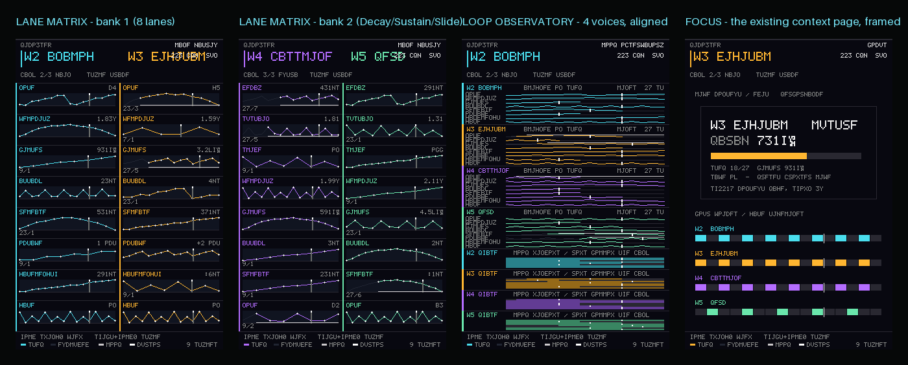
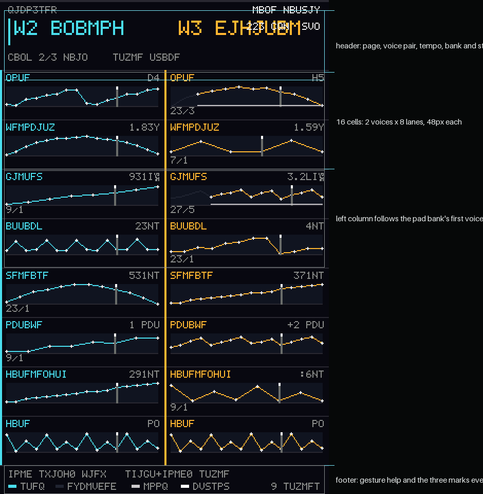
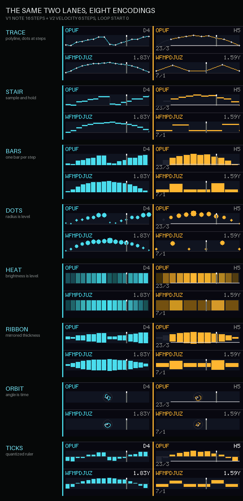
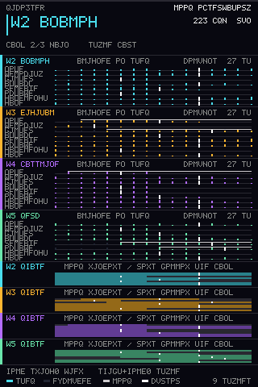
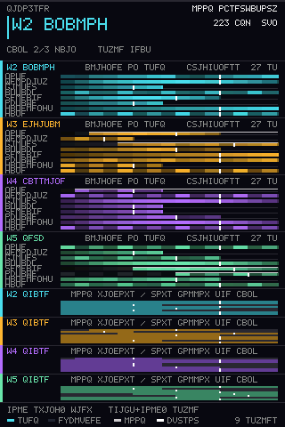
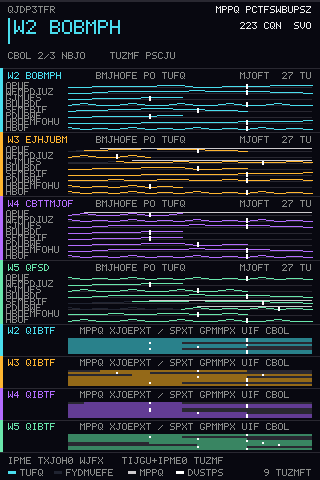
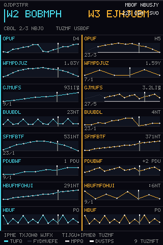
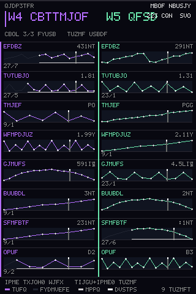
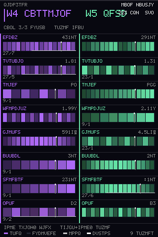
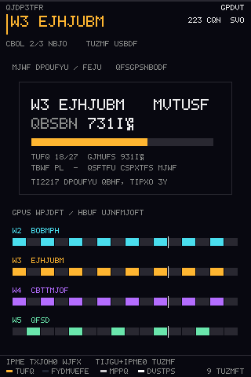

# Lane visualization guide

These images are rendered by the firmware's own drawing code, not by a mockup.
`tests/tools/lane_display_demo.cpp` replays `src/display/LaneDisplay.h` — the same
templates the Pico runs — into an RGB565 buffer, so positions, palette, geometry
and every encoding below are the ones the panel draws. The only host-only part
is the 5x7 text font used to make the labels legible; the panel uses its own
bitmap font.

They are **synthetic host renders**. They are not photographs of a panel, and
they establish nothing about backlight, colour temperature, viewing angle or
refresh behaviour on real hardware.

Regenerate after any change to the renderer:

```bash
python scripts/render_display_demos.py            # configures, builds, renders
python scripts/render_display_demos.py --skip-build   # reuse the built tool
```

The demo data is deliberately polymetric: Note runs 16 steps, Filter 8, Velocity
6 on one voice, and several lanes carry nonzero loop starts. Different lengths
and one live cursor per lane are the two facts the screens exist to show.

## The two new screens at a glance



## Layout map



Four fixed bands, top to bottom: header (68px), body (384px), footer (28px).
The body is the only part the page changes.

## The same two lanes, eight encodings



Pick a style with `Shift + hold Swing`. Every style keeps four facts readable:
time order along the lane, the lane's own length, its loop start, and its
current cursor. What changes is which visual channel carries the level.

| Style | Level is encoded by | Best for | Cost |
|---|---|---|---|
| `TRACE` | vertex height on a polyline | shape of a melodic contour | sparse lanes look empty between steps |
| `STAIR` | bar height, held to the next step | step sequencer feel, exact step values | dense lanes merge into blocks |
| `BARS` | bar height | quick loud/quiet balance across lanes | 64 steps in a 148px plot is a comb |
| `DOTS` | circle radius | spotting accents and rests | radius is harder to compare than height |
| `HEAT` | cell brightness | very dense lanes, no vertical axis needed | exact values are not readable |
| `RIBBON` | mirrored thickness about the centre | dynamics around a resting value | a level of 0 is a thin line, not a gap |
| `ORBIT` | radial distance, time as angle | seeing a loop as one closed period | not comparable with the rectangular styles |
| `TICKS` | quantized ticks above/below a centre line | reading the composed value as numbers | shape is coarse |

## Loop Observatory


Four sections, one per voice, all eight lanes stacked and **aligned on the same
absolute step axis**: "what is changing together" becomes a vertical read. The
right edge of each section names the micro encoding in use.




Five pixels is too little for eight distinct encodings, so the Observatory maps
them onto three honest ones instead of pretending a radar fits in a row:

| Style selector | Observatory row | Where else it lands |
|---|---|---|
| `TRACE`, `STAIR`, `RIBBON`, `ORBIT` | `LINES` — connected micro sparkline | Trace, Stair, Ribbon, Orbit |
| `BARS`, `TICKS`, `DOTS` | `COLUMNS` — discrete spikes | Bars, Ticks, Dots |
| `HEAT` | `BRIGHTNESS` — intensity cells | Heat |

The bottom four sections of the page are the phase rows: each voice's eight
lanes drawn as their loop windows on the same axis, so polymetric drift is
visible directly. Rows follow the current bank order, top to bottom. These rows
look the same in every style on purpose — they show loops, not levels.



## Lane Matrix



The Matrix is 2 columns x 8 rows. The columns are the same voice pair as the
physical step pads: select Voice 1 or 2 and you see voices 1-2, select Voice 3
or 4 and you see voices 3-4. Each cell carries the patch-specific lane name
(`Bright` for a waveguide's Filter slot, `Ratio` for a sync recipe's Attack) and
the composed value in musical units.

| Bank | Rows |
|---|---|
| 1 (MAIN) | Note, Velocity, Filter, Attack, Release, Octave, Gate Length, Gate |
| 2 (EXTRA) | Decay, Sustain, Slide, then Velocity, Filter, Attack, Release, Note again |

All eleven real lanes are reachable across the two banks; the repeats exist so a
long envelope lane can be compared against a short filter lane side by side.
No lane appears that the sequencer does not have.




## Reading the marks

The footer repeats these three marks on every screen:

| Mark | Meaning |
|---|---|
| voice-coloured bar or dots | a step's stored level, quantized to 0-255 across that lane's own range |
| dim / `EXCLUDED` | steps before a nonzero loop start: still visible, not played |
| `LOOP` underline | the loop's span, from its start step to the lane's last step |
| `CURSOR` (white) | this lane's play head right now — never any other lane's |
| `16/4` badge in a cell | lane length / loop start, shown only when a lane is not the default 16 from step 0 |

Heights and radii are lane coordinates, not measured audio. The textual value in
each cell carries the musical units (Hz, ms, s, semitones, ratios, `On`/`Rest`).
For lanes whose meaning depends on the patch, the value is the composed playback
value, including patch-following lanes — never the `-1` follow sentinel.

## Preserved pages



The context page is not reimplemented for the larger panel. Every existing
screen (preset browser, ADSR, reverb, tuning, arpeggiator, step edit and the
transient notices) still renders through the same code as before and is shown at
2x inside a frame, with all four gate timelines beneath it. The demo draws a
schematic in the frame's interior; the real page comes from the SH1106 renderer.

See [display setup, wiring and controls](../st7796-display.md).
