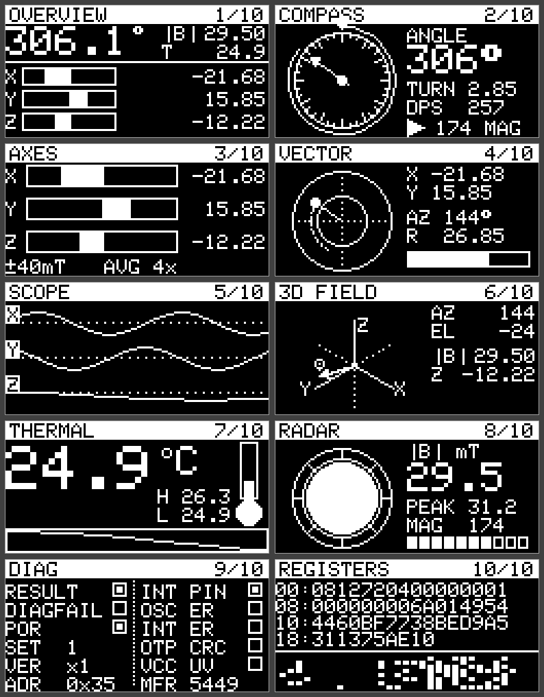

# EncoderAlchemy

 This is the Arduino driver we ship with our magnetic encoder known as the
Velocity Encoder.


It does the basics you would expect from a magnetic encoder library, and one
thing you probably would not: it knows how fast you are turning. Slow motion
gives fine control; fast motion covers range. That is the whole reason this
driver exists.

Two sensors are supported behind one API, and you pick which one you are using
with a single field:

| | **AS5600** | **TMAG5273** |
|---|---|---|
| Type | 12-bit on-axis magnetic encoder | 3D Hall-effect sensor with CORDIC angle engine |
| Resolution | 4096 counts/rev | 5760 counts/rev (1/16°) |
| Default address | `0x36` | `0x22` (B parts, as fitted; also `0x35`, `0x78`, `0x44`) |
| Supply | 3.3V or 5V | **3.3V only** (1.7–3.6V part) |
| Also gives you | — | X/Y/Z field in mT, die temperature, vector magnitude, diagnostics |

There is also an optional **SH1106G OLED helper** for building readouts, and an
example that puts every last thing a TMAG5273 knows onto ten cycling screens.

## Features

- **One API, two sensors.** Set `Config::sensor` and the rest of your sketch
  does not change. Counts-per-revolution, the default I2C address and the wrap
  handling all follow automatically.
- **Raw and normalized angle** — the sensor's native counts and a 0.0–1.0
  reading, plus degrees.
- **Multi-turn cumulative position** with wrap-around correction. Several
  revolutions in the same direction add up instead of jumping back at the top of
  the count range. Use it for endless-encoder UIs.
- **Filtered angular speed** in degrees/second. An adaptive low-pass filter
  smooths less when you move fast and more when you move slow, with a noise gate
  that keeps the reading still when the knob is still.
- **Velocity-scaled parameter increment** (`getParameterIncrement()`): turn slow
  for fine adjustment, fast for a wide sweep. The response curve is fully tunable
  via `MagEncoder::Config`.
- **Full TMAG5273 driver** (`TMAG5273`): three magnetic axes in millitesla, die
  temperature in °C, the CORDIC angle engine, resultant vector magnitude,
  conversion and device status flags, configurable ranges, averaging, power
  modes, thresholds and interrupts, and raw access to the whole register map.
- **Optional OLED helper** (`AlchemyOled`): title bars, bar meters, centre-zero
  meters, segment meters, dials, needles, arcs, ring gauges, vectorscopes,
  sparklines and cell-addressed text on a 128×64 SH1106G.
- **Connection detection**, so a sketch can degrade gracefully when no magnet is
  fitted.
- **No mandatory dependencies** — the core needs only `Wire` and the Arduino
  core. The OLED helper compiles to nothing unless you ask for it.

## Hardware

### AS5600

| AS5600 pin | Connect to |
|---|---|
| VCC | 3.3V or 5V (check your breakout's regulator) |
| GND | GND |
| SDA | board SDA |
| SCL | board SCL |

### TMAG5273

| TMAG5273 pin | Connect to |
|---|---|
| VCC | **3.3V** — this is a 1.7–3.6V part, do not feed it 5V |
| GND | GND |
| SDA | board SDA |
| SCL | board SCL |
| TEST | GND |
| INT | optional; leave unconnected unless you use interrupts |

The Velocity Encoder board fits a **TMAG5273B**, which answers at `0x22`, and
that is what the library defaults to. For an A, C or D part pass
`TMAG5273::ADDRESS_A` / `_C` / `_D` in the config — the address is set by the
orderable part suffix, so read the marking on the die if you are unsure, or run
the **I2CBusCheck** example and let it tell you. The magnetic range family
(`x1` = ±40/±80 mT, `x2` = ±133/±266 mT) is read back from `DEVICE_ID` at
`begin()`, so millitesla readings come out right for whichever part you fitted
without you telling the library which one it is.

### OLED (optional)

Any 128×64 SH1106G module on the same I2C bus, default address `0x3C`.

## Installation

In the Arduino IDE, use **Sketch → Include Library → Add .ZIP Library…** on a
zip of this folder, or drop the `EncoderAlchemy/` folder into your `libraries/`
directory. The library is architecture-independent (`architectures=*`) and builds
on any core that provides a working `TwoWire`.

For the OLED examples you also need **Adafruit SH110X** and **Adafruit GFX
Library** from the Library Manager. Sketches that do not use the display need
neither.

## Quick start

```cpp
#include <MagEncoder.h>

MagEncoder encoder;   // AS5600 by default

void setup()
{
    Serial.begin(115200);
    if (!encoder.begin())
    {
        Serial.println("Sensor not found.");
        while (true) { delay(1000); }
    }
}

void loop()
{
    encoder.update();
    Serial.println(encoder.getNormalizedAngle(), 3);
    delay(50);
}
```

### Choosing the TMAG5273 instead

```cpp
MagEncoder::Config cfg;
cfg.sensor = MagEncoder::Sensor::TMAG5273;
// Leave i2cAddress at 0 and the sensor's own default (0x22) is used.
// cfg.i2cAddress = TMAG5273::ADDRESS_A;   // for an A part

MagEncoder encoder(cfg);
```

Or, when the defaults are fine, just:

```cpp
MagEncoder encoder(MagEncoder::Sensor::TMAG5273);
```

Everything downstream — `getParameterIncrement()`, `getCumulativePosition()`,
`getVelocityZone()` — behaves identically. The only visible difference is that
`getRawAngle()` now counts to 5759 instead of 4095, which
`getCountsPerRevolution()` will tell you.

## Velocity-sensitive parameter control

The headline feature: turn slowly, get fine control; turn fast, cover range.
Pass a `[min, max]` range and how many full turns should span it:

```cpp
float parameter = 0.0f;

void loop()
{
    encoder.update();

    float increment = encoder.getParameterIncrement(0.0f, 1.0f, 4);
    parameter = constrain(parameter + increment, 0.0f, 1.0f);

    Serial.println(parameter, 3);
    delay(5);
}
```

The curve that maps angular speed to a per-count multiplier is tunable via
`MagEncoder::Config`:

```cpp
MagEncoder::Config cfg;
cfg.minVelDps         = 90.0f;   // below this, multiplier = minScale
cfg.maxVelDps         = 2400.0f; // above this, multiplier = maxScale
cfg.minScale          = 0.008f;  // slow-turn multiplier
cfg.maxScale          = 3.2f;    // fast-turn multiplier
cfg.curveExponent     = 1.8f;    // mid-range curve shape
cfg.velocitySmoothing = 0.08f;   // EMA factor (smaller = smoother, laggier)

MagEncoder encoder(cfg);
```

These defaults are the curve we use in our own instruments. They are a starting
point, not a verdict — every knob feels different, and every player has a
preference.

## Reading the rest of the TMAG5273

When the encoder is configured for a TMAG5273, `encoder.tmag()` hands you the
underlying driver. `encoder.update()` already refreshed it, so there is no
second I2C transaction to pay for:

```cpp
TMAG5273 &mag = encoder.tmag();

encoder.update();

float bx = mag.getX();                // millitesla
float by = mag.getY();
float bz = mag.getZ();
float t  = mag.getTemperature();      // degrees C
float a  = mag.getAngle();            // 0.0 .. 359.9375
float b  = mag.getFieldMagnitude();   // sqrt(x^2 + y^2 + z^2)

if (mag.getDeviceStatus().vccUnderVolt) { /* brownout */ }
```

The driver can also be used entirely on its own, without `MagEncoder`:

```cpp
#include <TMAG5273.h>

TMAG5273::Config cfg;
cfg.channels   = TMAG5273::MagChannels::XYZ;
cfg.anglePair  = TMAG5273::AnglePair::XY;
cfg.averaging  = TMAG5273::ConvAvg::X16;

TMAG5273 sensor(cfg);
sensor.begin();
sensor.update();
```

## OLED readouts

`AlchemyOled` wraps `Adafruit_SH1106G` and adds the drawing vocabulary a sensor
readout is actually written in. Name the Adafruit headers in your sketch before
including it — the Arduino builder works out the include path by reading the
`#include` lines it can see, and `AlchemyOled.h`'s own include is behind
`__has_include`:

```cpp
#include <Adafruit_GFX.h>
#include <Adafruit_SH110X.h>
#include <AlchemyOled.h>

AlchemyOled oled;

void setup()
{
    oled.begin();               // returns false if the panel is absent
}

void draw(float value)
{
    oled.clear();
    oled.title("FIELD", "1/10");
    oled.bipolarBar(2, 16, 100, 9, value, 40.0f);
    oled.ringGauge(96, 40, 18, 4, value / 40.0f);
    oled.at(0, 5).print("Bx ");
    oled.gfx().print(value, 2);
    oled.show();
}
```

`gfx()` is always there for anything the helper does not cover.

## API reference

### `MagEncoder::Config`

| Field | Default | Description |
|---|---|---|
| `sensor` | `Sensor::AS5600` | Which part is fitted. |
| `i2cAddress` | `0` | `0` means "use the selected sensor's default" (`0x36` / `0x22`). |
| `readIntervalMs` | `5` | Minimum ms between sensor reads. |
| `minVelDps` / `maxVelDps` | `90` / `2400` | Speed range the curve is defined over. |
| `minScale` / `maxScale` | `0.008` / `3.2` | Slow- and fast-turn multipliers. |
| `curveExponent` | `1.8` | Mid-range curve shape. |
| `velocitySmoothing` | `0.08` | EMA factor for the velocity scale. |
| `tmag` | — | A `TMAG5273::Config`, ignored when `sensor` is `AS5600`. |

### Setup / polling

| Method | Description |
|---|---|
| `bool begin(TwoWire& = Wire)` | Initialize I2C and detect the sensor. Returns false if not present. Pass `Wire1` to use a second bus. |
| `void update()` | Read the sensor and refresh derived state. Throttled to `readIntervalMs`. Call every loop. |
| `bool isConnected()` | Returns whether `begin()` detected the sensor. |

### Read-only state

| Method | Description |
|---|---|
| `uint16_t getRawAngle()` | Native counts: 0–4095 (AS5600) or 0–5759 (TMAG5273). |
| `float getNormalizedAngle()` | Raw angle normalized to 0.0–1.0. |
| `float getAngleDegrees()` | Shaft angle in degrees, 0.0–360.0. |
| `int32_t getCumulativePosition()` | Multi-turn position with wrap-around unwrapped. |
| `float getAngularSpeed()` | Filtered angular speed in °/s. |
| `float getPositionPercentage(maxRotations)` | Cumulative position as 0.0–1.0 across N turns. |
| `VelocityZone getVelocityZone()` | Coarse `Idle`/`Low`/`Mid`/`High` qualitative reading. |
| `Sensor getSensor()` / `const char* getSensorName()` | Which part this instance drives. |
| `uint8_t getI2CAddress()` | The address in use, sentinel resolved. |
| `uint16_t getCountsPerRevolution()` | 4096 or 5760. |
| `TMAG5273& tmag()` | The underlying TMAG5273 driver. |

### Parameter control

| Method | Description |
|---|---|
| `float getParameterIncrement(min, max, maxRotations)` | Velocity-scaled per-call increment for adjusting a parameter. |
| `float takeParameterIncrement(min, max, maxRotations)` | Same, but drains an internal count accumulator so each count is applied exactly once. Use this in any loop faster than `readIntervalMs`. |
| `int32_t pendingTicks()` / `void clearPendingTicks()` | Inspect or drop undrained counts (e.g. after a mode switch). |
| `float getVelocityScale()` | The multiplier the increment math is currently using, for display. |
| `float mapPositionToRange(min, max, maxRotations)` | Absolute mapping of cumulative position into a range (no velocity scaling). |

### State management

| Method | Description |
|---|---|
| `void resetCumulativePosition(position = 0)` | Reset the counter and reseed the internal baseline. |

### `TMAG5273`

| Method | Description |
|---|---|
| `bool begin(TwoWire& = Wire)` | Verify the manufacturer ID, learn the range family, write the config. |
| `bool update()` | Burst-read temperature, X, Y, Z, status, angle and magnitude. |
| `float getX() / getY() / getZ()` | Magnetic flux density in millitesla. |
| `int16_t getRawX() / getRawY() / getRawZ()` | The signed 16-bit ADC codes. |
| `float getFieldMagnitude()` | √(x²+y²+z²) in millitesla. |
| `float getAzimuth() / getElevation()` | Field direction in and out of the XY plane. |
| `float getTemperature()` | Die temperature in °C. |
| `float getAngle()` / `uint16_t getRawAngle()` | CORDIC angle in degrees / in 1/16° counts. |
| `uint8_t getMagnitude()` | The device's own 8-bit resultant magnitude. |
| `getConversionStatus() / getDeviceStatus()` | Decoded `CONV_STATUS` and `DEVICE_STATUS`. |
| `getVersion() / getVersionName() / getManufacturerId()` | Part identification. |
| `getRangeXY() / getRangeZ()` | Full-scale range in mT for the fitted part. |
| `setMagChannels / setTemperatureChannel / setAnglePair` | Which channels convert. |
| `setAveraging / setTempCo / setOperatingMode / setSleepTime` | Conversion and power behaviour. |
| `setRanges / setLowNoiseMode` | Sensitivity and noise/current trade-off. |
| `setMagneticGain / setMagneticOffsets / setMagneticThresholds` | Trim and comparator setup. |
| `setInterrupt / triggerConversion / clearStatusFlags` | INT pin and latched flags. |
| `readRegister / writeRegister / readRegisters / readRegisterMap` | Raw register access. |

### `AlchemyOled`

Text: `at`, `atPixel`, `text`, `textCentered`, `textRight`, `textWidth`, `title`.
Meters: `bar`, `barVertical`, `bipolarBar`, `segmentBar`.
Round things: `dial`, `needle`, `arc`, `ringGauge`, `polar`, `arrowHead`,
`vector`. Plots: `sparkline`, `dottedHLine`, `dottedVLine`, `plotFrame`.
Frame control: `clear`, `show`, `gfx`.

## Examples

- **BasicReading** — print raw/normalized/cumulative/speed every 50 ms.
- **VelocitySensitiveKnob** — adjust a float parameter with velocity scaling,
  plus a button to reset the cumulative position. Set `SENSOR_CHOICE` at the top
  to pick AS5600 or TMAG5273, and `ENABLE_OLED` to add a ring-gauge readout.
- **TMAG5273Explorer** — everything a TMAG5273 knows, across ten OLED screens
  cycled by a button on GP0. Short press changes screen, long press resets peak
  hold and history.

  

  *The example's own frame buffers, rendered off a simulated sensor turning a
  magnet in the XY plane — not a photograph of a panel.*


  | | Screen | What it shows |
  |---|---|---|
  | 1 | OVERVIEW | Angle set large, field strength, temperature, all three axes as centre-zero meters |
  | 2 | COMPASS | Ticked dial with needle and sweep arc, turn counter, speed, direction |
  | 3 | AXES | Full-width centre-zero bar meters for X, Y and Z |
  | 4 | VECTOR | XY-plane vectorscope with a persistence trail |
  | 5 | SCOPE | Three scrolling waveform lanes, one per axis |
  | 6 | 3D FIELD | Isometric axes with the field vector and its shadow on the XY plane |
  | 7 | THERMAL | Big temperature read, thermometer graphic, history sparkline, min/max |
  | 8 | RADAR | Field magnitude as a proximity radar with a peak-hold ring |
  | 9 | DIAG | Conversion and device status flags, IDs, addresses |
  | 10 | REGISTERS | Hex dump of the register map plus a live bit texture |

- **MIDI2HiResKnob** — USB MIDI knob example. Open it in the Arduino IDE to
  send a 14-bit MIDI 1.0 CC pair via MIDIUSB, or build it with PlatformIO on
  Pico 2 to send true MIDI 2.0 UMP with 32-bit CC values.

## License

MIT, see [LICENSE](LICENSE).
